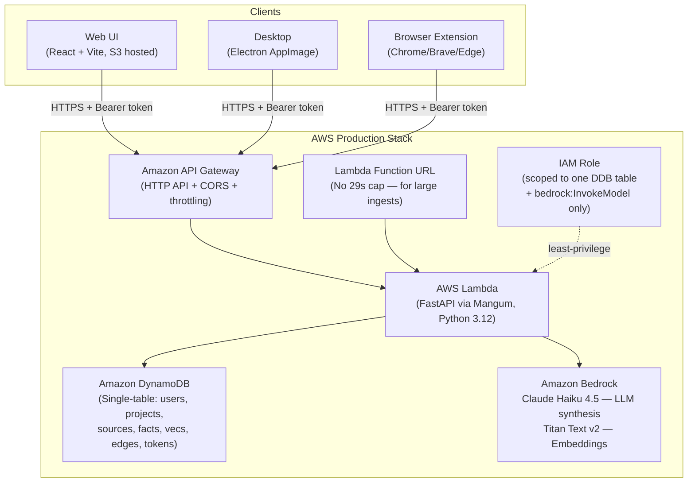
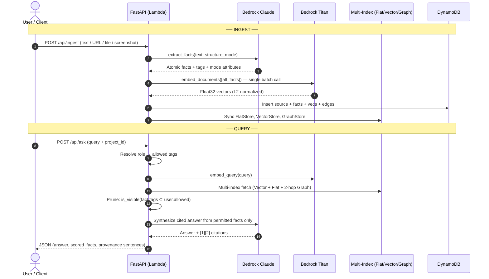
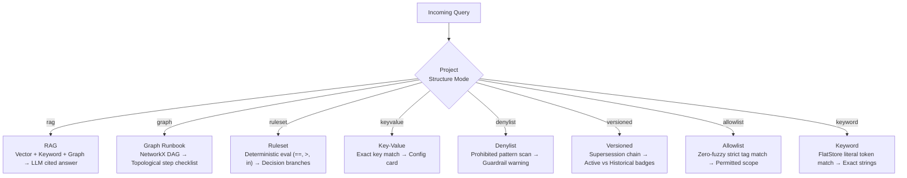
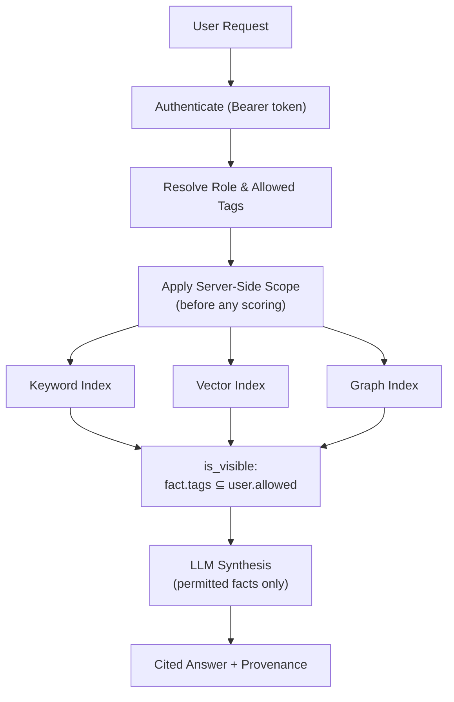

<div align="center">

# ContextForge

**Your team's scattered knowledge, unified — searchable, cited, and permission-aware.**

Built for the **First Commit Hackathon · Amazon × WeMakeDevs · Build it, Ship it Track**

[](https://python.org)
[](https://fastapi.tiangolo.com)
[](https://aws.amazon.com)
[](#license)

[Live Demo](http://contextforge-ui-271740378665.s3-website.us-east-1.amazonaws.com/) · [Video Walkthrough](https://www.youtube.com/watch?v=gTbsAqlYaK0) · [GitHub](https://github.com/CodeCraftsmanRaj/MAANG_paglu)

</div>

---

## The Problem

Knowledge in a team is scattered — Slack threads, Google Docs, GitHub comments, browser tabs, people's heads. When a new hire or even a veteran engineer needs a reliable answer, they end up hunting through old conversations or asking someone who might not be around.

**ContextForge** solves this by turning everything a team knows into a structured, searchable knowledge base where every answer carries its source and is visible only to people who should see it.

> Create a project → ingest links, files, notes, screen sessions, or AI chats → ask in plain language → get a cited answer drawn only from what your role is allowed to see.

---

## What It Does

```
 CAPTURE (Automatic)              STORE (Provenance + RBAC)             RETRIEVE (Dynamic)
 ─────────────────────            ─────────────────────────────          ─────────────────────
 • Links & web pages              • Keyword Index (Tokens)               • Keyword exact match
 • Files & notes                  • Vector Index (Bedrock Titan v2)      • Semantic / vector search
 • Browser AI chats          ──▶  • Graph Index (2-hop walk)        ──▶  • Graph topology walk
 • Screen capture (OCR)           • Cryptographic SHA-256 provenance     • LLM cited answer synthesis
 • Browser extension              • Tag-based RBAC (role-scoped)         • Markdown context packs
 • Watched local folder           • LLM-extracted relations              • 8 dynamic retrieval modes
```

### Key Capabilities

| Capability | Detail |
|---|---|
| **Permission-aware retrieval** | Tag-based RBAC enforced server-side on every query across all three indexes |
| **Tri-index search** | Keyword, Vector (Titan embeddings), and Graph (2-hop entity walk) combined |
| **8 retrieval paradigms** | RAG, Graph Runbook, Ruleset, Key-Value, Denylist, Versioned, Allowlist, Keyword |
| **Screen capture & OCR** | Electron desktop shell with automatic capture → Vision LLM transcription |
| **Browser extension** | One-click capture from Notion, GitHub, AI chat sessions |
| **Cited answers** | Bedrock's Claude synthesizes answers with `[1]`, `[2]` citations |
| **Pluggable providers** | Swap local ↔ AWS providers via environment variables — zero code changes |
| **Serverless AWS** | Lambda + API Gateway + DynamoDB — nothing runs when idle |

---

## Architecture

### High-Level System Overview



### Ingestion & Retrieval Pipeline



### 8 Dynamic Retrieval Paradigms



### Security & RBAC Model



> **Key invariant:** `is_visible(fact_tags, allowed)` — a fact is visible only if **every** tag on the fact is in the user's allowed set (strict subset). Applied to every fact, across all three indexes, in all 8 modes. Graph traversal is also pruned: restricted nodes are never used as information bridges.

---

## AWS Architecture (Production)

The entire backend is a single CloudFormation/SAM stack — one-command deploy, one-command teardown:

| Component | Service | Detail |
|---|---|---|
| **Compute** | AWS Lambda (Python 3.12) | FastAPI app adapted via Mangum (open-source ASGI adapter) |
| **API** | Amazon API Gateway (HTTP API) | Public URL, CORS, throttling |
| **Long requests** | Lambda Function URL | No 29s cap — for large URL ingests |
| **Database** | Amazon DynamoDB (single-table) | Users, projects, sources, facts, vecs, edges, tokens — pay-per-request |
| **LLM** | Amazon Bedrock — Claude Haiku 4.5 | Fact extraction, structure classification, cited answer synthesis |
| **Embeddings** | Amazon Bedrock — Amazon Titan Text v2 | 1536-dimension semantic vector index |
| **IAM** | Scoped Lambda execution role | `dynamodb:*` on one table + `bedrock:InvokeModel` only |
| **Static hosting** | Amazon S3 | React web UI (no server required) |
| **IaC** | AWS SAM / CloudFormation | Reproducible infra, one `deploy.sh` command |

**Cost at demo scale:** Lambda + API Gateway are within the free tier. Bedrock is pay-per-token — a full weekend demo costs cents (Claude Haiku 4.5 + Titan embeddings).

---

## Pluggable Provider Architecture

The same codebase runs locally (lightweight providers) or on AWS (managed services) — swap via environment variables, no code changes:

| Component | `ENV` Variable | Local / Dev | Production AWS |
|---|---|---|---|
| **LLM** | `LLM_PROVIDER` | Groq — Llama 3.3 / Qwen | Bedrock — Claude Haiku 4.5 |
| **Embeddings** | `EMBEDDING_PROVIDER` | FastEmbed — BGE-Small (384d) | Bedrock — Amazon Titan v2 (1536d) |
| **Database** | `REPO_PROVIDER` | SQLite (`contextforge2.db`) | DynamoDB (single-table) |
| **Hosting** | — | Uvicorn + FastAPI | Lambda + Mangum |

---

## Detailed Documentation

| Document | Description |
|---|---|
| [Backend Architecture](./backend/BACKEND_ARCHITECTURE.md) | Exhaustive technical reference: module map, all 8 retrieval paradigms, RBAC semantics, vector-space compatibility guard, batch vectorization, natural-language provenance engine, full REST API reference |
| [End-to-End Lifecycle](./backend/END_TO_END_LIFECYCLE.md) | Step-by-step walkthrough of how data flows from raw intake → LLM extraction → multi-index storage → RBAC-scoped retrieval → cited answer synthesis |
| [AWS Deployment Guide](./infra/README.md) | One-command SAM deploy, Bedrock model access setup, smoke tests, cost breakdown, troubleshooting common errors |

---

## Getting Started

### Option 1 — Use the Live Deployment

The backend is already running on AWS. Open the web UI and start immediately:

**[http://contextforge-ui-271740378665.s3-website.us-east-1.amazonaws.com/](http://contextforge-ui-271740378665.s3-website.us-east-1.amazonaws.com/)**

Register an account (the first account is automatically admin), create a project, and start ingesting.

### Option 2 — Download the Desktop App

The Electron desktop app adds automatic screen capture (no picker required):

1. Open the repository's **Actions** tab on GitHub
2. Select the latest successful **Build Desktop** workflow run
3. Download the artifact for your OS — **Linux AppImage**, **Windows `.exe`**, or **macOS `.dmg`**

### Option 3 — Install the Browser Extension

Capture context from Notion, GitHub, and AI chat sessions directly from your browser:

1. Open `chrome://extensions/` in Chrome, Brave, or Edge
2. Enable **Developer mode** → **Load unpacked** → select the `extension/` folder
3. In the ContextForge Web UI, go to **Capture** → **Copy session token**
4. Open the extension **Options** → paste your Bearer Token and API URL → Save

---

## Local Development

### Prerequisites

- Python 3.10+ and [`uv`](https://github.com/astral-sh/uv)
- Node.js 18+ and `npm`

### 1. Backend

```bash
cd backend
cp .env.local .env          # uses Groq + FastEmbed + SQLite by default
uv pip install -r requirements.txt
uv run main.py              # → http://127.0.0.1:8000
```

The local stack uses **Groq** (LLM) + **FastEmbed** (embeddings) + **SQLite** — no AWS credentials needed.

### 2. Frontend

```bash
cd frontend
npm install
npm run dev                 # → http://localhost:5173
```

### 3. Desktop (Electron)

```bash
cd frontend
npm run desktop             # launches Electron shell pointing at localhost
```

### Key Environment Variables

See [`backend/.env.local.example`](./backend/.env.local.example) for local dev and [`backend/.env.production.example`](./backend/.env.production.example) for AWS production config.

| Variable | Values | Purpose |
|---|---|---|
| `LLM_PROVIDER` | `gemini`, `groq`, `bedrock`, `heuristic` | Generative LLM |
| `EMBEDDING_PROVIDER` | `gemini`, `fastembed`, `bedrock`, `hashed` | Vector embeddings |
| `REPO_PROVIDER` | `sqlite`, `dynamodb` | Persistence layer |
| `GROQ_API_KEY` | `gsk_...` | Groq API key (local dev) |
| `AWS_REGION` | `us-east-1` | AWS region for Bedrock & DynamoDB |

---

## Deploy to AWS

```bash
cd infra
./deploy.sh contextforge        # ~3 minutes; prints ApiUrl + FunctionUrl
./smoke_test.sh "<ApiUrl>"      # verifies register → ingest → embed (Titan) → ask (Claude) end-to-end
```

Full instructions, prerequisites, and cost breakdown → [`infra/README.md`](./infra/README.md)

---

## Project Structure

```
ContextForge/
│
├── backend/                        # FastAPI application
│   ├── app/
│   │   ├── api.py                  # All REST endpoints
│   │   ├── auth.py                 # Auth, RBAC, is_visible()
│   │   ├── structuring.py          # FlatStore, VectorStore, GraphStore, RAG pipeline
│   │   ├── strategies.py           # 8 retrieval strategy implementations
│   │   ├── ingestion.py            # Ingestion pipeline & directory watcher
│   │   ├── factory.py              # Environment-driven provider injection
│   │   ├── db.py                   # SQLite schemas, migrations, auto-seeding
│   │   └── providers/              # LLM, Embedding, Repository implementations
│   ├── BACKEND_ARCHITECTURE.md     # Full technical reference
│   ├── END_TO_END_LIFECYCLE.md     # Data flow walkthrough
│   ├── lambda_handler.py           # Mangum ASGI adapter entry point
│   ├── .env.local.example          # Local dev template
│   └── .env.production.example     # AWS prod template
│
├── frontend/                       # React + Vite web UI
│   ├── src/                        # Capture, Find, Team views
│   └── electron/                   # Electron desktop shell
│
├── extension/                      # Chrome/Brave/Edge browser extension
│
├── infra/                          # AWS SAM / CloudFormation
│   ├── template.yaml               # SAM template (Lambda, API GW, DynamoDB, IAM)
│   ├── deploy.sh                   # One-command deploy
│   ├── build_lambda.sh             # Slim Lambda package builder
│   ├── smoke_test.sh               # End-to-end production smoke test
│   └── README.md                   # Deployment guide
│
├── .github/workflows/              # GitHub Actions (Build Desktop)
└── README.md
```

---

## Team — MAANG_PAGLU

Built by **Team MAANG_PAGLU** · Hackathon: **MAANG_PAGLU · FA7N4V · First Commit**

| Member | Role | WeMakeDevs | GitHub | LinkedIn | Resume |
|---|---|---|---|---|---|
| **Rishabh Shenoy** *(Lead)* | Project management, docs, demo, integration | — | [CodingEnthusiastic](https://github.com/CodingEnthusiastic) | [LinkedIn](https://www.linkedin.com/in/rishabh-shenoy-3b3566286/) | [Resume](https://drive.google.com/file/d/1QAwGpv8wdaTT2_iLw6bHp5AP-6kOq45s/view) |
| **Shivsharan Sanjawad** | React frontend, Electron desktop, UI/UX | [@shivsharan](https://www.wemakedevs.org/shivsharan) | [ShivsharanSanjawad](https://github.com/ShivsharanSanjawad) | [LinkedIn](https://www.linkedin.com/in/shivsharan-sanjawad/) | [Resume](https://drive.google.com/file/d/1s_o9lW0m_VIRan76W5-cvNJDhd0la0Qq/view) |
| **Raj Mathuria** | FastAPI backend, RAG pipeline, Bedrock integration | [@rajmathuria](https://www.wemakedevs.org/rajmathuria) | [CodeCraftsmanRaj](https://github.com/codeCraftsmanRaj/) | [LinkedIn](https://www.linkedin.com/in/raj-mathuria-98a710283/) | [Resume](https://drive.google.com/file/d/1YK6fohXpyqxRlYLskznHW8bxbYCfeA95/view) |
| **Vishwesh Nair** | AWS architecture, SAM/CloudFormation, infra deploy | [@enayut](https://www.wemakedevs.org/enayut) | [Enayut](https://github.com/Enayut) | [LinkedIn](https://www.linkedin.com/in/vishwesh-nair-a924a127a/) | [Resume](https://drive.google.com/file/d/1ivvQ1ZawUKRDu8b9GjJiuvr7VJTfRvHO/view) |

### What Each Person Built

<details>
<summary><strong>Rishabh Shenoy (Team Lead)</strong></summary>

- Managed the project end to end: scoped the hackathon build, split work across backend, frontend, and infra, and kept the team on track to the deadline
- Wrote and maintained the project documentation — README, local-development guide, and the AWS deployment guide
- Prepared the submission material: demo script, walkthrough, and video recording/editing of the working product
- Coordinated integration across the stack, aligning API contracts between backend, frontend, and deployment
- Owned final verification of the demo flow (register → ingest → ask) before submission

</details>

<details>
<summary><strong>Shivsharan Sanjawad (Frontend & Desktop)</strong></summary>

- Built the React (Vite) frontend: Capture, Find, and Team views covering the full workflow from ingest to cited answers
- Designed the UI/UX: drag-and-drop ingestion, screen-capture flow, per-fact provenance sentences, structure-mode indicators, and "Viewing as" role preview
- Integrated the frontend with the backend API (token-based auth, view-as header, error handling) against both local dev and deployed AWS API
- Built the Electron desktop shell with automatic screen capture (no-picker display media handler) and packaged it as a Linux AppImage distributable
- Added frontend unit tests for the provenance formatter and kept local development (Vite proxy) working alongside the production build

</details>

<details>
<summary><strong>Raj Mathuria (Backend & RAG Pipeline)</strong></summary>

- Built the FastAPI backend: auth (PBKDF2 password hashing, bearer sessions, roles), projects, ingestion, retrieval, and ask endpoints
- Designed the pluggable provider architecture (LLM, embeddings, fact repository, ingestors) so local and AWS providers swap via environment variables with no code changes
- Implemented the RAG/retrieval pipeline — keyword, vector, and graph (NetworkX) indexes with role/tag-based access filtering applied server-side on every query
- Integrated Amazon Bedrock (Claude for fact extraction, structure classification, and cited answers; Titan for embeddings) and the SQLite/DynamoDB repository layer behind a single interface
- Wrote and ran backend tests, including a SQLite/DynamoDB parity suite, and validated the deployed API

</details>

<details>
<summary><strong>Vishwesh Nair (AWS Infrastructure)</strong></summary>

- Designed and deployed the AWS architecture (API Gateway HTTP API → Lambda/FastAPI → DynamoDB → Bedrock) as an AWS SAM/CloudFormation template
- Wrote the build and deploy scripts: Lambda packaging (`build_lambda.sh`, slim deps without heavy local-only libraries), `deploy.sh` one-command SAM deploy, and the public smoke test script
- Provisioned DynamoDB (single table, pay-per-request, TTL, PITR), the Lambda execution IAM policy (scoped to the table and `bedrock:InvokeModel`), API Gateway CORS/throttling, and the Lambda Function URL
- Configured Bedrock models in the infrastructure (Claude Haiku 4.5 inference profile + Titan Embeddings v2) with region and model-id parameters
- Deployed to production, ran the end-to-end smoke test against the live API, and hosted the web UI on Amazon S3

</details>

---

## Blog Posts

Three posts documenting the journey from idea to deployed production:

1. [The Knowledge Heist — Building ContextForge on AWS](https://builder.aws.com/content/3JaDPLBKPhYePbUEdez1577qJAl/the-knowledge-heist-building-contextforge-on-aws)
2. [Our Backend Worked on a Laptop — Lambda Had Other Plans](https://builder.aws.com/content/3Jaut1kgcgvcsXw7gQx44KrAafO/our-backend-worked-on-a-laptop-lambda-had-other-plans)
3. [From Localhost to Production — Deploying ContextForge on AWS](https://builder.aws.com/content/3JavCdywN5MkpQQZTyHoWBXapdO/from-localhost-to-production-deploying-contextforge-on-aws)

---

## Links

| Resource | Link |
|---|---|
| **Live Web UI** | [contextforge-ui-271740378665.s3-website.us-east-1.amazonaws.com](http://contextforge-ui-271740378665.s3-website.us-east-1.amazonaws.com/) |
| **Video Walkthrough** | [youtube.com/watch?v=gTbsAqlYaK0](https://www.youtube.com/watch?v=gTbsAqlYaK0) |
| **GitHub Repository** | [github.com/CodeCraftsmanRaj/MAANG_paglu](https://github.com/CodeCraftsmanRaj/MAANG_paglu) |

---

## License

MIT

---

<div align="center">

**ContextForge — Capture. Structure. Secure. Retrieve.**

*Built by Team MAANG_PAGLU · First Commit Hackathon · Amazon × WeMakeDevs*

</div>

