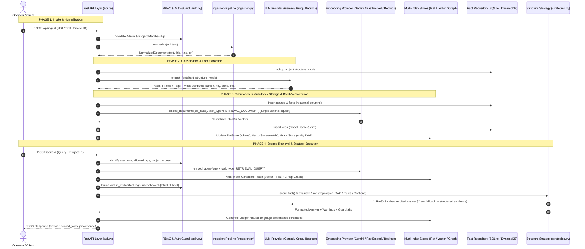
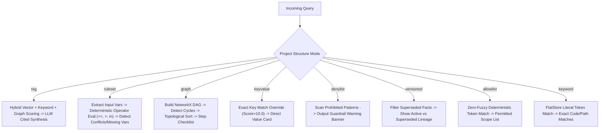

# ContextForge: End-to-End Data & Execution Lifecycle

An exhaustive step-by-step walkthrough of how data moves through ContextForge: from raw intake and ingestion, through classification, LLM extraction, batch vector embedding, and multi-index storage, to RBAC-scoped retrieval, deterministic strategy evaluation, provenance rendering, and answer synthesis.

---

## High-Level Lifecycle Flowchart



---

## Detailed Step-by-Step Breakdown

---

### Step 1: Intake & Normalization

Data enters the system via one of four intake channels:
1. **Direct Text Paste**: Raw text or markdown supplied via `POST /api/ingest` or the UI.
2. **Web URL / Documentation**: Fetched and cleaned via `URLIngestor`.
3. **Directory Watcher**: Background poller (`app/ingestion.py:watch()`) monitoring files for auto-ingest.
4. **Live Screen Capture**: Base64 screenshots transcribed via Vision OCR (`GroqLLMProvider` using `llama-4-scout` or `GeminiLLMProvider` using `gemini-2.5-flash`).

#### Normalization:
- Produces a `NormalizedDocument` (`text`, `title`, `kind`, `uri`).
- Generates a stable cryptographic SHA-256 fingerprint: `source_id = sha256(uri)[:16]`.

---

### Step 2: Project Resolution & Mode Determination

1. **Project Scoping**: The source is mapped to the requested `project_id` (or assigned to `"proj_default"`).
2. **Dynamic Structure Mode**:
   - The project possesses an assigned `structure_mode` (one of `rag`, `ruleset`, `keyvalue`, `denylist`, `versioned`, `graph`, `allowlist`, `keyword`).
   - If omitted at creation, `LLMProvider.classify_project_mode()` inspects project title and content sample to assign the mode with stored rationale.

---

### Step 3: Atomic Fact Extraction & Tag Assignment

1. **Granular Extraction**: `LLMProvider.extract_facts(text, structure_mode)` parses the document into atomic facts.
2. **Attribute Population**:
   - `graph` mode: extracts `action`, `owner`, and `depends_on`.
   - `ruleset` mode: extracts `condition`, `outcome`, and integer `priority`.
   - `keyvalue` mode: extracts canonical `key` and value.
   - `versioned` mode: extracts `key`, `valid_from`, and automatically supersedes older facts.
   - `denylist` mode: routes prohibited anti-patterns to `rejected_facts` with justification `reason`.
3. **RBAC Tagging**: Assigns taxonomy tags (`["backend", "deploy", "database", "api", "frontend", "process"]`).

---

### Step 4: Simultaneous Multi-Index Storage & Batch Vectorization

A critical architectural feature of ContextForge is that **all indexes are populated simultaneously**:

```
                       ┌───► vecs table & VectorStore (Dense Embeddings)
                       │
Incoming Ingested Fact ├───► FlatStore (Literal Token & Key Index)
                       │
                       ├───► edges table & GraphStore (Entity Relational DAG)
                       │
                       └───► Structured Columns (action, owner, key, condition, tags)
```

1. **Relational Persistence**: Writes to `sources` and `facts` tables with all structured columns.
2. **Batch Vector Embedding (`VectorStore.index_batch`)**:
   - To prevent hitting API rate limits (such as Google Gemini's 100 Requests Per Minute free tier quota), all extracted facts are batched into a **single HTTP batch request** via `batchEmbedContents`.
   - Ingesting a document with 25 facts consumes **1 single request** rather than 25 individual calls.
   - Vectors are $L_2$-normalized and stored in `vecs` with `(model_name, dim)`.
3. **Multi-Index Updates**:
   - `FlatStore`: Tokenizes fact text into lowercase alphanumeric token sets.
   - `GraphStore`: Inserts entity relations $(a, \text{rel}, b)$ into the NetworkX graph.

---

### Step 5: Query Intake & Orthogonal RBAC Scoping

When an operator queries via `POST /api/retrieve` or `POST /api/ask`:

1. **Authentication**: Resolves Bearer token to user identity, role, and allowed permission tags.
2. **Project Isolation**: Verifies project access via `can_access_project()`. Returns `HTTP 404` if unauthorized to prevent project existence enumeration.
3. **Query Embedding**: The active provider embeds the query with `task_type="RETRIEVAL_QUERY"`.
4. **Vector-Space Compatibility Guard**: Verifies that project vectors match the active model/dim. If mismatched, emits an upgrade warning notice.
5. **Multi-Index Candidate Retrieval**:
   - Vector similarity dot products.
   - Flat token intersection scores.
   - 2-hop BFS entity walk in `GraphStore`.
6. **Strict RBAC Subset Enforcement (`is_visible`)**:
   - Evaluates: $\text{is\_visible}(T_{\text{fact}}, \text{Allowed}) \iff T_{\text{fact}} \subseteq \text{Allowed}$.
   - **Graph Traversal Pruning**: If an intermediate graph node is restricted, the traversal drops the path and **never uses restricted facts as information bridges**.

---

### Step 6: Strategy Scoring, Decision Logic & Execution

Surviving facts are processed by the active `BaseStructureStrategy`:



#### Mode Execution Breakdown:
- **`rag` Mode**: Blends vector cosine similarity, keyword overlap, and 2-hop graph entity context into a **narrative cited answer** with `[1]`, `[2]` citations.
- **`graph` Mode**: Constructs a NetworkX `DiGraph` from `action` and `depends_on` attributes, verifies DAG acyclicity via `nx.simple_cycles()`, runs `nx.topological_sort()`, and formats an **Execution Runbook Checklist**:
  ```markdown
  Step 1: Build Docker container images · Owner: DevOps Engineer · Prerequisite: None [1]
  Step 2: Run automated tests · Owner: QA Lead · Prerequisite: Build Docker container images [2]
  ```
- **`ruleset` Mode**: Parses input variables (e.g. `order_total=1200`), evaluates comparison operators (`==`, `!=`, `>`, `<`, `>=`, `<=`, `in`, `contains`), checks for rule conflicts, and outputs **Decision Branches**.
- **`keyvalue` Mode**: Exact canonical key lookup returning the direct configuration card.
- **`denylist` Mode**: Scans for prohibited anti-patterns, outputting a high-priority warning banner.
- **`versioned` Mode**: Filters superseded versions by default, exposing `CURRENT (ACTIVE)` vs `HISTORICAL (SUPERSEDED by #N)` badges when `include_history=True`.

---

### Step 7: Natural-Language Provenance & Response Assembly

Before returning the JSON payload, ContextForge renders provenance for every cited fact according to the **Ledger Design System**:

$$\text{"From } \{\text{source description}\} \text{, } \{\text{project context}\} \text{, } \{\text{when}\} \text{."}$$

- **Kind Translation**: `text` $\rightarrow$ `"a pasted note"`, `url` $\rightarrow$ `"a web page"`, `screenshot` $\rightarrow$ `"a screenshot (OCR)"`, `file` $\rightarrow$ `"a file"`.
- **Title Heuristic**: Meaningful titles in quotes (`"Production Release Procedure"`). Empty/generic titles use the first ~6 words: `starting "Step 1: Build Docker..."`.
- **Domain Links**: URLs render domain links (`notion.so`) pointing to the target URL.
- **RBAC Redaction**: Unauthorized source titles/URIs render as `"From a restricted source."`

---

## Lifecycle Summary Table

| Stage | Trigger / Input | Primary Module | Core Logic & Invariants | Output Artifact |
| :--- | :--- | :--- | :--- | :--- |
| **1. Intake** | Text, URL, File, Screenshot | `app/providers/ingestors.py`, `app/ingestion.py` | Normalizes content, runs Vision OCR if image, generates SHA-256 ID. | `NormalizedDocument` |
| **2. Mode Resolution** | Content sample + Project title | `app/providers/llm.py` | LLM classifies project into 1 of 8 structure modes with stored rationale. | `project.structure_mode` |
| **3. Fact Extraction** | Document text + Mode | `app/providers/llm.py` | Splits into atomic facts; parses mode fields (`action`, `key`, `cond`, `depends_on`). | List of `Fact` objects + tags |
| **4. Batch Vectorization** | Fact texts | `app/providers/embeddings.py`, `app/structuring.py` | Single `batchEmbedContents` HTTP call, $L_2$ normalizes, stores `(model, dim)`. | `vecs` table entries |
| **5. Multi-Index Sync** | Facts + Vectors + Entities | `app/structuring.py`, `app/db.py` | Writes to SQLite/DynamoDB, syncs `FlatStore`, `VectorStore`, and `GraphStore`. | Updated persistent & memory indexes |
| **6. Scoped Retrieval** | User query + Bearer token | `app/auth.py`, `app/structuring.py` | Resolves role; enforces $T_{\text{fact}} \subseteq \text{Allowed}$; validates vector model compatibility. | Filtered candidate facts |
| **7. Strategy Execution** | Candidates + Query | `app/strategies.py` | Executes DAG topological sort, deterministic rule evaluation, or RAG synthesis. | Structured Answer + Citations |
| **8. Provenance Render** | Cited sources | `app/structuring.py` | Converts source metadata into Ledger natural-language sentence. | Formatted JSON API response |
