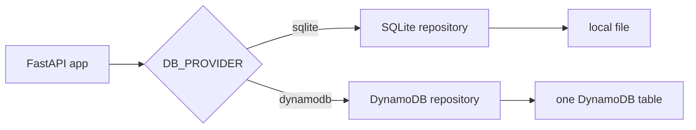

# Our Backend Worked on a Laptop. Lambda Had Other Plans.

## The comfort of a local file

For most of the build, ContextForge's backend was a friendly thing: FastAPI, a SQLite file, and Python. Users, tokens, projects, facts — nine tables in one file (`app/db.py`). Registration wrote a row, login read it back, a bearer token landed in a `tokens` table. Authentication state lived on disk, and disk is something you never have to think about until it's gone.

## What Lambda takes away

Moving the app to AWS Lambda removes three things a laptop gives you for free.

First, the filesystem. Lambda gives you writable space in `/tmp`, but nothing there survives between invocations. Our whole auth story — "check the tokens table in the SQLite file" — depended on a file that would simply not exist on the next request. A login could succeed and the very next authenticated call could fail, because the session was written somewhere ephemeral.

Second, a server. There is no uvicorn process to run; Mangum bridges API Gateway events into the FastAPI ASGI app instead. That part was genuinely easy — the handler is two lines — but it changes what "starting the app" means.

Third, SQL itself, once we picked DynamoDB: no joins, no `WHERE` on arbitrary columns, no `AUTOINCREMENT`. Every access pattern has to be designed up front.

## The abstraction that saved us

We didn't retrofit this — the codebase already routed every storage operation through one interface (`FactRepository`) selected by an environment variable. So the Lambda version wasn't a rewrite; it was a second implementation behind the same contract:

Flip `DB_PROVIDER=dynamodb` and the same `register()`, `login()`, and fact-search code paths run unchanged. That was the whole point: local development keeps working exactly as before while production runs on AWS.

## One table to hold everything

DynamoDB rewards single-table design, so users, sessions, projects, sources, facts, and roles all live in one table keyed by partition patterns — `USER#alice`, `TOKEN#...`, `PROJECT#...`, `FACT#...`, `ROLE#...`. Some details mattered more than I expected:

- **Tokens with an expiry.** Sessions now carry a TTL attribute (30 days), so DynamoDB deletes them automatically. Auth state survives redeploys and cleans up after itself.
- **Seeding without races.** Default roles get inserted idempotently with a condition (`attribute_not_exists`) so cold starts on a fresh table don't collide.
- **Deduplication needed a new trick.** Locally, "have we already stored this exact fact?" was one `SELECT ... WHERE text = ?`. DynamoDB can't answer that without a designed access pattern, so every fact also writes a tiny pointer item under a hash of its text. The question became a `GetItem` instead of a scan.
- **Vectors as bytes.** Embeddings are stored base64-encoded right on the fact item, tagged with the model and dimension, so retrieval filters to vectors from the same embedding space.
- **Boring type hygiene.** DynamoDB has no float type, so timestamps get stored as strings and converted back at the boundary. Small, but the kind of thing that produces confusing bugs if ignored.

And the scan calls that power listing paginate — handling `LastEvaluatedKey` correctly matters the moment a table grows past one page.

## Proving the two backends behave the same

The scariest failure mode would be subtle drift: SQLite and DynamoDB answering the same question differently. So the test suite runs the DynamoDB repository under **moto** (an AWS mock) and asserts parity on real scenarios — project CRUD, token-to-role resolution, fact history chains, vector round-trips. On top of that sit behavioral tests: an RBAC matrix across all eight retrieval modes × three roles × two projects, including adversarial checks like a scoped user querying another project's secrets and a mixed-tag fact (`frontend` + `secret`) refusing to leak to someone holding only `frontend`.

Those tests caught things reasoning wouldn't have. Seeing "member role querying the wrong project gets an empty result, not an error message that confirms the project exists" written as an executable check changed how I thought about API design.

## Trimming the suitcase

One more Lambda-specific decision: the production package drops fastembed entirely — a heavyweight ONNX dependency used for local embeddings — because Bedrock Titan does embeddings in production. The embedding provider lazily falls back to lightweight hashed vectors if fastembed isn't importable, so an accidental import can never crash a cold start. The result is a slim `lambda-build/` package with only what the runtime actually needs.

## What I learned

A backend that works locally has made silent promises: files persist, SQL is available, state sticks around. Serverless revokes all three, and the fix isn't cleverness — it's an interface drawn early enough that swapping storage is boring. The single most valuable habit was keeping both implementations honest through shared tests instead of trusting that "it works on my machine."

If I did it again, I'd write the parity tests even earlier. Everything else about the migration followed from wanting them to pass.
