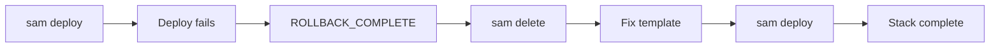

# Two CloudFormation Errors Between Us and Production

## The plan: one command, whole backend

ContextForge's backend is a FastAPI app — API Gateway → Lambda → DynamoDB → Bedrock (Claude for synthesis, Titan for embeddings). On paper, AWS SAM made the deployment story trivial: one `template.yaml`, one `deploy.sh`, one command. And most of it really was that simple. The template declares a DynamoDB table (single-table, pay-per-request, TTL for session tokens, point-in-time recovery), an HTTP API with open CORS, a Lambda function with a scoped IAM policy, and a direct Lambda Function URL as a no-29-second-cap alternative entry point.

The build script (`build_lambda.sh`) stages a slim package — runtime code plus wheels installed explicitly for Python 3.12 / x86_64, so the bundle is ABI-correct even when built from a different host. Locally, everything validated. Then we ran the deploy for real, and CloudFormation reminded us who's in charge.

## Failure #1: the reserved variable we weren't allowed to set

The first failure came from an environment variable. Our application reads `AWS_REGION` to find its DynamoDB table and Bedrock endpoints, so the obvious move was to set it explicitly in the Lambda's environment configuration.

CloudFormation refused: **`AWS_REGION` is a reserved key.** Lambda injects it automatically on every invocation — it equals the function's own region — and you cannot define it yourself. The deployment failed before anything was created.

The fix was clarifying rather than annoying: remove the variable and let Lambda provide it. The application already read it via `os.getenv("AWS_REGION")`, so no code change was needed at all — only the template. The final template carries a comment at exactly that spot, so the next person doesn't repeat us:

```yaml
Environment:
  Variables:
    DB_PROVIDER: dynamodb
    LLM_PROVIDER: bedrock
    # NOTE: AWS_REGION is reserved — Lambda injects it automatically
```

## Failure #2: a reference that didn't exist

The second failure was subtler and taught me the most about CloudFormation. An earlier template version referenced the Function URL through the function itself, along the lines of `!GetAtt ApiFunction.FunctionUrl`. It failed validation — that attribute simply doesn't exist on `AWS::Serverless::Function`. SAM lint caught it before the deploy did, which is exactly what lint is for.

The correct approach was to declare the Function URL as a first-class resource and reference *that*:

```yaml
ContextForgeFunctionUrl:
  Type: AWS::Lambda::Url
  Properties:
    TargetFunctionArn: !GetAtt ApiFunction.Arn
    AuthType: NONE
```

…plus its `AWS::Lambda::Permission` so unauthenticated `lambda:InvokeFunctionUrl` calls are allowed. Declaring it explicitly had a side benefit: the output that prints the URL becomes a deterministic `!GetAtt` against the URL resource itself, not a guess about what attributes SAM might expose.

## ROLLBACK_COMPLETE: the state that eats redeployments

The first deploy attempt died mid-provisioning, which left the stack in **ROLLBACK_COMPLETE**. Here's the part I hadn't understood before: a stack in that state is not "mostly working, fix the resource." It is terminal — CloudFormation will not update it. Every subsequent deploy attempt failed with an error telling us the stack was in a non-updateable state.

The recovery path is conceptually simple but easy to resent: delete the failed stack, fix the template, deploy fresh. `sam delete` (or a CloudFormation console delete), then:

```bash
./deploy.sh contextforge
```

Because everything — table, IAM role, Lambda, API, Function URL — lives in one stack, a clean redeploy was genuinely that simple. One lesson worth keeping: when a stack fails, fix *before* the next attempt. Repeated failed deploys against a rollback-complete stack just burn time.

The sequence that finally worked:



## Smoke testing the result

With the stack green, the smoke test script exercised the entire production path in one run: API status → register a user → create a project → ingest a fact (Claude extracts atomic facts; Titan embeds them via Bedrock) → ask a question (retrieval picks facts, Claude writes a cited answer). All green meant the deployed URL was real.

Two configuration details deserve credit for the system working on the first smoke test:

- **IAM scoping.** The Lambda role gets exactly `DynamoDBCrudPolicy` on its one table plus `bedrock:InvokeModel` on foundation models and inference profiles. Nothing else — no `AdministratorAccess` debugging crutch.
- **Bedrock model access.** Titan embeddings work on every account out of the box; Anthropic models require a one-time opt-in in the Bedrock console. Knowing that distinction in advance saved a confusing `AccessDeniedException` later.

## What I learned

Deployment debugging is its own skill, separate from writing the application. Two failures, both fully self-inflicted, both invisible until the moment CloudFormation evaluated the template:

1. **Read the constraints before inventing configuration.** `AWS_REGION` was the kind of assumption that feels harmless until the service rejects it. Managed services reserve names for good reasons.
2. **CloudFormation's rollback model is unforgiving by design.** A failed stack isn't a broken thing to patch — it's evidence to delete and a template to correct.
3. **Lint before deploy, every time.** The `!GetAtt` mistake cost seconds with lint and would have cost a full failed deploy cycle without it.

The template now carries comments documenting each lesson at the exact line where it happened — the cheapest possible insurance against a third failure.
